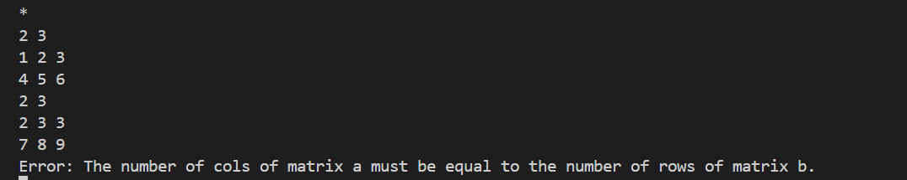

# 解题思路

## 矩阵加法

## 矩阵减法

## 矩阵乘法

## 矩阵数乘

## 矩阵转置

## 行列式求解

对方阵 $`A = (a_{ij})_n`$ 做如下初等变换

$$
\begin{pmatrix}
a_{11} & \cdots & a_{1n}\\
\vdots &  & \vdots \\
a_{n1} & \cdots & a_{nn}
\end{pmatrix}
\xrightarrow
[i = 2, 3, \cdots, n]
{R_i-\frac{a_{i1}}{a_{11}} \times R_1}
\begin{pmatrix}
a_{11} & a_{12} & \cdots & a_{1n}\\
0 & a_{22} - \frac{a_{21} \times a_{12}}{a_{11}} & \cdots & a_{2n} - \frac{a_{21} \times a_{1n}}{a_{11}} \\
\vdots & \vdots  &   & \vdots \\
0 & a_{n2} - \frac{a_{n1} \times a_{12}}{a_{11}} & \cdots & a_{nn} - \frac{a_{n1} \times a_{1n}}{a_{11}}
\end{pmatrix}
$$

则

$$
\begin{vmatrix}
a_{11} & \cdots & a_{1n}\\
\vdots &  & \vdots \\
a_{n1} & \cdots & a_{nn}
\end{vmatrix} =
\begin{vmatrix}
a_{11} & a_{12} & \cdots & a_{1n}\\
0 & a_{22} - \frac{a_{21} \times a_{12}}{a_{11}} & \cdots & a_{2n} - \frac{a_{21} \times a_{1n}}{a_{11}} \\
\vdots & \vdots  &   & \vdots \\
0 & a_{n2} - \frac{a_{n1} \times a_{12}}{a_{11}} & \cdots & a_{nn} - \frac{a_{n1} \times a_{1n}}{a_{11}}
\end{vmatrix} = a_{11} \times
\begin{vmatrix}
a_{22} - \frac{a_{21} \times a_{12}}{a_{11}} & \cdots & a_{2n} - \frac{a_{21} \times a_{1n}}{a_{11}} \\
\vdots  &   & \vdots \\
a_{n2} - \frac{a_{n1} \times a_{12}}{a_{11}} & \cdots & a_{nn} - \frac{a_{n1} \times a_{1n}}{a_{11}}
\end{vmatrix}
$$

$n = 1$ 时，

$$
\begin{vmatrix}A\end{vmatrix}
= a_{11}
$$

> DEBUG: 当 $a_{11} = 0$ 时，进行互换操作，使得满足 $a_{11} \neq 0$ 行列式的值变号；若不存在 $a_{11} \neq 0$，则行列式值为0。

## 逆矩阵求解

原理：

$$
\begin{array}{c:c} (A & E) \end{array}
\xrightarrow[]{仅有限次初等行变换}
\begin{array}{c:c} (E & A^{-1}) \end{array}
$$

操作：构造矩阵进行消元

## 秩的求解

与[thinking.md](doc/thinking.md)中思路一致

## 矩阵的迹

